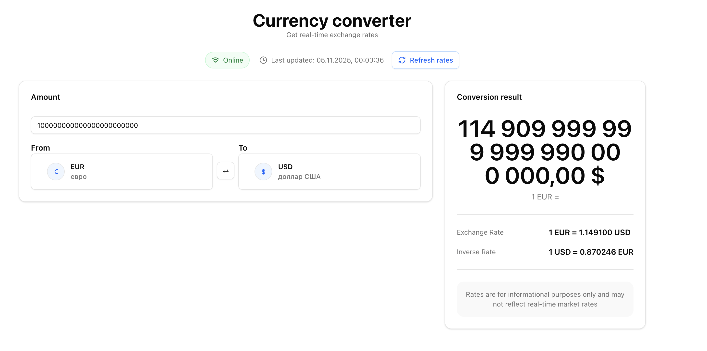

# Currency Converter — React + TypeScript (FSD, shadcn/ui, TanStack Query)

Single-page currency converter with live exchange rates, caching, and offline support.



## Stack

- React + TypeScript + Vite
- Architectural pattern: Feature-Sliced Design (FSD)
- UI: shadcn/ui (Radix + Tailwind v4)
- Data fetching/cache: TanStack Query v5

## Getting started

1. Install dependencies:

```bash
npm i
```

2. Run dev server:

```bash
npm run dev
```

3. Build:

```bash
npm run build && npm run preview
```

No API key required by default — the app uses VATComply (`https://api.vatcomply.com/rates`). To switch to another provider, add the client and wire it in `shared/api` and the `useRates` hook.

## Project structure (FSD)

```
src/
  app/               # app shell, providers, styles
  entities/          # domain logic (rates)
    currency/
      ui/Option.tsx
  pages/
    HomePage.tsx
  shared/            # shared libs, ui kit, api...
    api/*
    lib/*
    model/*
    ui/kit/*
    utils/*
  widgets/
    converter/
      api/*
      model/*
      ui/*
```

## Key decisions

- VATComply chosen: free, no key; base currency varies (often EUR). Conversion uses formula `rate(A→B) = rate(Base→B) / rate(Base→A)`.
- Caching: last successful response persisted to `localStorage` with timestamp. Used automatically when offline.
- React Query provides in-memory cache with `staleTime = 5m`; manual persistence ensures offline operation.
- UX: last currencies and amount are remembered in `localStorage`. Live recalculation while typing. Refresh button triggers refetch.

## Accessibility & responsiveness

- Two breakpoints: mobile (≤767px) and desktop (≥767px). Layout uses responsive Tailwind classes.
- Keyboard navigation in the modal supports typing and Enter to select.
